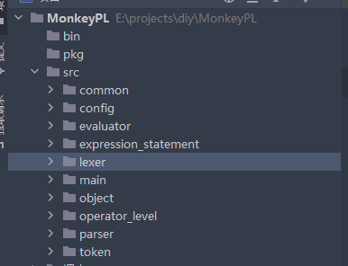

>   该语言来自书籍[用go语言自制解释器](https://weread.qq.com/web/bookDetail/74d32120813ab6de0g019b0e)
>
>   配套代码 https://interpreterbook.com/waiig_code_1.7.zip

# MonkeyPL

```js
let age = 1
let name = "Monkey"
let result = 10 * (20 / 2)

let thorsten = {"name": "Thorsten", "age": 28}
myArray[0]       // => 1
thorsten["name"] // => "Thorsten"

let add = fn(a, b) { return a + b }

let fibonacci = fn(x) {
  if (x == 0) {
    0
  } else {
    if (x == 1) {
      1
    } else {
      fibonacci(x - 1) + fibonacci(x - 2)
    }
  }
}

//高阶函数
let twice = fn(f, x) {
  return f(f(x))
}

let addTwo = fn(x) {
  return x + 2
}
// 我们将addTwo作为变量传入了twice函数中
twice(addTwo, 2) // => 6

```



# 词法分析

>   在进行编译初期，我们需要将源代码分隔为词法单元(token)，然后再构建抽象语法树(AST)。
>
>   
>
>   将源代码分隔为词法单元的过程被称为**词法分析**。词法分析器也叫词法单元生成器(tokenizer)或者扫描器(scanner)

如`let x = 5 + 5;`会被token生成器解析为：

```sql
[
  LET,
  IDENTIFIER("x"),
  EQUAL_SIGN,
  INTEGER(5),
  PLUS_SIGN,
  INTEGER(5),
  SEMICOLON
]
```

### token

一个token就是编程语言中不能再分隔的最小词法单元,例如下边的代码中,包含token:**let，five，=，5，ten，10，fn，(, x, y, ),{**等等

```js
let five = 5;
let ten = 10;

let add = fn(x, y) {
  x + y;
};

let result = add(five, ten);
```

一个token应该包含类型以及字面量,因此token的定义如下:

```go
// MonkeyPL/src/token/token.go
package token
import "fmt"
type TokenType int
type Token struct {
	Type    TokenType //类型
	Literal string    //字面量
}

func (t *Token) String() string {
	return fmt.Sprintf("Token{Type: %s;literal: %s}", Names[t.Type], t.Literal)
}
```

此外token也有很多种,这里用枚举表示:

```go
// MonkeyPL/src/token/token.go
const (
	ILLEGAL = iota
	EOF
	// id
	ID // add, foobar, x, y, ...
	// 整数
	INT // 1343456
	// 运算符
	ASSIGN    //=
	PLUS      //+
	MINUS     // -
	BANG      // !
	ASTERISK  // *
	SLASH     // /
	BACKSLASH // \
	LE
	GE
	LT
	GT
	EQ
	NE
	// 分隔符
	COMMA     // ,
	SEMICOLON // ;
	LPAREN    //(
	RPAREN    //)
	LBRACE    //{
	RBRACE    //}
	SPACE
	EOL
	// 关键字
	FUNCTION // fn
	LET      // let
	TRUE
	FALSE
	IF
	ELSE
	RETURN
)

```

此外,因为我们选用整数作为TokenType,因此我们还需要一个map从而得到Token名:

```go
// MonkeyPL/src/token/names.go

var Names = map[TokenType]string{
	ILLEGAL:   "ILLEGAL",
	EOF:       "EOF",
	ID:        "ID",
	LE:        "LE",
	GE:        "GE",
	LT:        "LT",
	GT:        "GT",
	EQ:        "EQ",
	NE:        "NE",
	INT:       "INT",
	ASSIGN:    "ASSIGN",
	PLUS:      "PLUS",
	MINUS:     "MINUS",
	BANG:      "BANG",
	ASTERISK:  "ASTERISK",
	SLASH:     "SLASH",
	BACKSLASH: "BACKSLASH",
	COMMA:     "COMMA",
	SEMICOLON: "SEMICOLON",
	LPAREN:    "LPAREN",
	RPAREN:    "RPAREN",
	LBRACE:    "LBRACE",
	RBRACE:    "RBRACE",
	SPACE:     "SPACE",
	EOL:       "EOL",
	FUNCTION:  "FUNCTION",
	LET:       "LET",
	TRUE:      "TRUE",
	FALSE:     "FALSE",
	IF:        "IF",
	ELSE:      "ELSE",
	RETURN:    "RETURN",
}
```

### 正则表达式

为了灵活和扩展性,我们选择用正则表达式来进行词法分析.对于正则表达式不清楚的请自行搜索学习

首先我们要明确有哪些token,以及定义token的词法规则,在Regs中我们定义了可能出现在代码中的token正则表达式

```go
// MonkeyPL/src/token/regs.go

var Regs = []struct {
	Type  TokenType
	Regex string
}{
	{INT, `(?:[1-9][0-9]*|0)`},
	{SPACE, `(?:\x20|\t)+`},
	{LE, `<=`},
	{GE, `>=`},
	{EQ, "=="},
	{NE, "!="},
	{LT, `\<`},
	{GT, `\>`},
	{ASSIGN, `=`},
	{PLUS, `\+`},
	{MINUS, `-`},
	{BANG, `!`},
	{ASTERISK, `\*`},
	{SLASH, `/`},
	{BACKSLASH, `\\`},
	{COMMA, `,`},
	{SEMICOLON, `;`},
	{LPAREN, `\(`},
	{RPAREN, `\)`},
	{LBRACE, `\{`},
	{RBRACE, `\}`},
	{EOL, "\n"},
	{FUNCTION, `fn`},
	{LET, `let`},
	{TRUE, `true`},
	{FALSE, `false`},
	{IF, `if`},
	{ELSE, `else`},
	{RETURN, `return`},
	{ID, `[_a-zA-Z][_a-zA-Z0-9]*`},
}
```

为了将正则表达式编译,我们采用了包级别的`init()`函数:
在该函数中,我们遍历了Regs,对于每一个正则表达式,我们将其封装在了带有组名的"壳子"中:

```go
// MonkeyPL/src/lexer
package lexer

var regs *regexp.Regexp
var groupNames []string

func init() {
	var tempRegs []byte

	for _, v := range token.Regs {
		tempRegs = append(tempRegs, []byte("(?P<"+strconv.Itoa(int(v.Type))+">"+v.Regex+")|")...)
	}
	tempRegs = tempRegs[:len(tempRegs)-1]
	regs = regexp.MustCompile(string(tempRegs))
	groupNames = regs.SubexpNames()
}
```

在封装完毕后,tempRegs变成了:
其中, <>中的数字代表组名,在这里则对应的是我们前边定义的常量tokenType, 例如 `(?P<30>else)`代表组名为30的组,它可以匹配 正则表达式内容为`else`的字符串。请结合lexer.pop()函数理解此处的regs

```
(?P<3>(?:[1-9][0-9]*|0))|(?P<23>(?:\x20|\t)+)|(?P<11><=)|(?P<12>>=)|(?P<15>==)|(?P<16>!=)|(?P<13>\<)|(?P<14>\>)|(?P<4>=)|(?P<5>\+)|(?P<6>-)|(?P<7>!)|(?P<8>\*)|(?P<9>/)|(?P<10>\\)|(?P<17>,)|(?P<18>;)|(?P<19>\()|(?P<20>\))|(?P<21>\{)|(?P<22>\})|(?P<24>\n)|(?P<25>fn)|(?P<26>let)|(?P<27>true)|(?P<28>false)|(?P<29>if)|(?P<30>else)|(?P<31>return)|(?P<2>[_a-zA-Z][_a-zA-Z0-9]*)
```

### 词法分析器

我们定义token变量和Lexer(词法分析器)变量,其中input是词法分析器输入的代码字符串:

>   这里可以Mark一下,等我们日后完成了解释器,再将 input由string替换为更强大的reader,从而从更多地方读取代码字符串

```go
// MonkeyPL/src/lexer
type Lexer struct {
	input    string
   pos 		int	//当前处理到的下标
	curToken token.Token
}

func New(input string) *Lexer {
	l := &Lexer{input: input}
	l.pop()
	for l.expectPeek(token.SPACE) {
		l.pop()
	}
	return l
}

func (l *Lexer) Empty() bool {
	return l.curToken.Type == token.EOF
}

func (l *Lexer) expectPeek(tokenType token.TokenType) bool {
	return tokenType == l.curToken.Type
}

func (l *Lexer) Peek() token.Token {
	return l.curToken
}

func (l *Lexer) Pop() token.Token {
	if l.Empty() {
		return l.curToken
	}
	returnVal := l.curToken
	l.pop()
	for l.expectPeek(token.SPACE) {
		l.pop()
	}

	return returnVal
}

func (l *Lexer) pop() {
	if l.pos == len(l.input) {
		l.curToken = newToken(token.EOF, "")
		return
	}

	res := regs.FindStringSubmatchIndex(l.input[l.pos:])

	if res[0] != 0 {
		l.curToken = newToken(token.ILLEGAL, string(l.input[l.pos]))
		l.pos++
		return
	}

	for i := 2; i < len(res); i += 2 {
		if res[i] == 0 {
			groupName, err := strconv.Atoi(groupNames[i/2])
			if err != nil {
				println(err.Error())
			}
			l.curToken = newToken(token.TokenType(groupName), l.input[l.pos:l.pos+res[i+1]])
			l.pos += res[i+1]
			return
		}
	}
}

func newToken(tokenType token.TokenType, literl string) token.Token {
	return token.Token{Type: tokenType, Literal: literl}
}


```

**FindStringSubmatchIndex做了什么**?

>   首先,FindStringSubmatchIndex返回的是一个数组,假设我们的正则表达式有`x`个组,组从`0~x-1`编号,则FindStringSubmatchIndex返回的数组长度为`2x+1`,其中,第`0`个元素代表所有组匹配起点的最小值,数组内第`y`个位置(`y`是奇数)代表第`y/2`组的匹配起点,数组内第`y+1`个位置代表第`y/2`组的匹配终点。
>
>   假设数组[1]=1,数组[2]=3,则代表第0组匹配起点为1,终点为3,此时说明第0组没有匹配到,因为我们希望匹配起点为0,由此可知,如果数组的第0个元素!=0,则代表所有的组都没有匹配成功。
>
>   `pop()`函数,按照Regs定义的顺序,将所有组的匹配结果都按顺序询问了一遍,将先遇到的匹配成功的组封装到token中并返回。


# 语法分析

>   语法分析器将文本或词法单元形式的源代码作为输入，产生一个表示该源代码的数据结构。在建立数据结构时，语法分析器会解析输入，检查其是否符合预期的结构。这个过程就称为语法分析。

我们现在要实现一个语法分析器来将下边的代码转为AST

```js
let x = 5;
let y = 10;
let foobar = add(5, 5);
let barfoo = 5 * 5 / 10 + 18 - add(5, 5) + multiply(124);
let anotherName = barfoo;
```

### 定义表达式和语句

>   在一般的编程语言中,一部分代码可以被分为表达式和语句,表达式是返回一个值的代码片段,而语句则无返回值.
>
>   ```cpp
>   int a=2+3-1;  // 表达式
>   if(a>0){			// 语句
>      ...
>   }
>   ```


```go
// ast/ast.go
package ast

//TokenLiteral()返回该节点对应的字面字符串
type Node interface {
	TokenLiteral() string
}

// 语句
type Statement interface {
	Node
	statementNode()
}

// 表达式
type Expression interface {
	Node
	expressionNode()
}


// 实现语句
type Program struct {
    Statements []Statement
}

func (p *Program) TokenLiteral() string {
    if len(p.Statements) > 0 {
        return p.Statements[0].TokenLiteral()
    } else {
        return ""
    }
}
```

### 定义let语句

```js
let x = 1+2 
```

在这段代码中,有三个部分是需要注意的: let,x还有1+2,因此let语句类需要三个部分:

```go

type LetStatement struct {
	Token token.Token // token.LET词法单元
	Name  *Id
	Value Expression
}

func (ls *LetStatement) statementNode()       {}
func (ls *LetStatement) TokenLiteral() string { return ls.Token.Literal }
```

此外,我们还需要一个表达式来存放变量名:

```go
type Id struct {
	Token token.Token // token.ID词法单元
	Value string
}

func (i *Id) expressionNode()      {}
func (i *Id) TokenLiteral() string { return i.Token.Literal }
```

### 语法分析器

### 解析let

### 解析return

### 解析if

现在看一段Monkey语言的 if-else语句,我们规定 if condition后必须接`{`并立马换一行,`}`不能与代码块同一行,else if 与if相同

```js
if x > y{
 	a=a+b   
} 
else{
  c=c+a   
}

if x>y{
   
} else if c>d{
   
}
```

我们的IfStatement需要4个部分:

1.   if代码块
2.   else代码块
3.   else-if代码块
4.   condition判断条件

于是我们定义`IfStatement`如下:

```go
type IfStatement struct {
	condition       Expression      //判断if条件的exprssion
	ifBlock         *BlockStatement //if判断成功后要执行的代码块
	elseBlock       *BlockStatement //if判断失败后要执行的代码块,可以为空,可以是ifStatement
	elseIfStatement *IfStatement    //BlockStatement
}

func NewIfStatment(condtion Expression, ifBlock *BlockStatement, elseBlock *BlockStatement, elseStatement *IfStatement) IfStatement {
	return IfStatement{condition: condtion, ifBlock: ifBlock, elseBlock: elseBlock, elseIfStatement: elseStatement}
}
func (is *IfStatement) statementNode() {}
func (is *IfStatement) Literal() string {
	var out bytes.Buffer

	out.WriteString("if ")
	out.WriteString(is.condition.Literal())
	out.WriteString(is.ifBlock.Literal())

	if is.elseBlock != nil {
		out.WriteString(" else")
		out.WriteString(is.elseBlock.Literal())
	}
	if is.elseIfStatement != nil {
		out.WriteString(" else ")
		out.WriteString(is.elseIfStatement.Literal())
	}
	out.WriteString("\n")
	return out.String()
}
func (is *IfStatement) String() string {
	var out bytes.Buffer

	out.WriteString("if ")
	out.WriteString(is.condition.String())
	out.WriteString(is.ifBlock.String())

	if is.elseBlock != nil {
		out.WriteString(" else")
		out.WriteString(is.elseBlock.String())
	}
	out.WriteString("\n")
	return out.String()
}
```

其中,`BlockStatement`是代码块,`BlockStatement`的定义如下:

```go

type BlockStatement struct {
	statements []Statement
	env        *object.Environment
}

func NewBlockStatement(statements []Statement, env *object.Environment) BlockStatement {
	return BlockStatement{env: env}
}

func (bs *BlockStatement) statementNode() {}
func (bs *BlockStatement) Literal() string {
	var out bytes.Buffer
	out.WriteString("{\n")
	for _, s := range bs.statements {
		out.WriteString(s.Literal() + "\n")
	}
	out.WriteString("}")
	return out.String()
}
func (bs *BlockStatement) String() string {
	var out bytes.Buffer
	out.WriteString("{\n")
	for _, s := range bs.statements {
		out.WriteString(s.String() + "\n")
	}
	out.WriteString("}")
	return out.String()
}
```

此外,我们要解析 blockStatement:
注意这里的细节,执行`parseBlockStatement`时,parser当前的token应该是`{`,并且代码的随后部分应该是一个由`{}`包住的若干语句。

```go

func (p *Parser) parseBlockStatement() (expression_statement.Statement, error) {
	p.nextToken()                 //跳过 {
	if !p.curTokenIs(token.EOL) { //判断是否是\n
		return p.handleErrorStatment(fmt.Errorf("The '{' should be followed by 'EOL'(\\n), not '%s' ", p.curToken.Literal))
	}
	p.nextToken() // 跳过EOL
	var blockStat []expression_statement.Statement
	for !p.curTokenIs(token.RBRACE) { //只要不是'}'便一直解析
		if p.l.Empty() {
			return p.handleErrorStatment(fmt.Errorf("Not found '}' "))
		}
		fmt.Println(p.curToken)

		stat, err := p.Next()
		if err != nil {
			return p.handleErrorStatment(err)
		}
		blockStat = append(blockStat, stat)
	}
	p.nextToken() //跳过 }
	blockStatement := expression_statement.NewBlockStatement(blockStat, &p.env)
	return &blockStatement, nil
}
```

随后,在完成了`parseBlockStatement`的基础上,我们再来实现`parseIfStatment`:
解析if语句十分复杂,需要考虑三种情况:

1.   仅`if{}`语句
2.   `if{} else{}`语句
3.   `if{} else if{}...`语句

```go

func (p *Parser) parseIfStatment() (expression_statement.Statement, error) {
	p.nextToken()                         //跳过 if
	condition, err := p.ParseExpression() //解析 condition
	if err != nil {
		return p.handleErrorStatment(err)
	}

	if !p.curTokenIs(token.LBRACE) {
		return p.handleErrorStatment(fmt.Errorf("'if %s ' should be followed by '{', not %s", condition.Literal(), p.curToken.Literal))
	}
	//解析if{}中的BlockStatement
	tempIfBlock, err := p.parseBlockStatement()
	if err != nil {
		return p.handleErrorStatment(err)
	}

	ifBlock, _ := tempIfBlock.(*expression_statement.BlockStatement)
	if p.curTokenIs(token.ELSE) { //这种情况是if{}else{}或者if{}else if{}
		p.nextToken() //跳过 else

		if p.curTokenIs(token.LBRACE) { //检查是否是else{} 的情况
			tempElseBlock, err := p.parseBlockStatement()
			if err != nil {
				return p.handleErrorStatment(err)
			}
			if !p.isLineEnd() { //解析完 else块后,下一个token应该是EOL
				return p.handleErrorStatment(fmt.Errorf("The 'else' block statement should be followed by EOL, not %s ", p.curToken.Literal))
			}
			p.nextToken() //跳过行尾
			elseBlock, _ := tempElseBlock.(*expression_statement.BlockStatement)
			ifStatment := expression_statement.NewIfStatment(condition, ifBlock, elseBlock, nil)
			return &ifStatment, nil
		} else if p.curTokenIs(token.IF) { //检查是否是 else if{}的情况
			//解析 if表达式
			tempElseIfStatement, err := p.parseIfStatment()
			if err != nil {
				return p.handleErrorStatment(err)
			}

			// 此处无需检查并跳过行尾,因为在` p.parseIfStatment()`中已经检查了
			elseIfStatement, _ := tempElseIfStatement.(*expression_statement.IfStatement)
			ifStatment := expression_statement.NewIfStatment(condition, ifBlock, nil, elseIfStatement)
			return &ifStatment, nil
		} else {
			return p.handleErrorStatment(fmt.Errorf("'else' should be followed by '{' or 'if', not '%s'", p.curToken.Literal))
		}
	}
	//以下是 if{}后不是else的情况
	if !p.isLineEnd() {
		return p.handleErrorStatment(fmt.Errorf("The 'if' block statement should be followed by EOL, not %s ", p.curToken.Literal))
	}
	p.nextToken() //跳过行尾
	ifStatment := expression_statement.NewIfStatment(condition, ifBlock, nil, nil)
	return &ifStatment, nil
}
```

最后,附上测试程序:

```go
func TestIfStatement(t *testing.T) {
	tests := []string{
		`if a>b{}`,
		`if a>b{
}else{
let b=1+2
}`,
		`if a<b{
}else if b>a{
}else{
}`,
		`if b>a{
`,
		`if b>a{
}else{}`,
	}
	for i, tt := range tests {
		println(i)
		parser := New(lexer.New(tt))
		nxt, err := parser.Next()
		_, ok := nxt.(expression_statement.NoMoreStatement)
		for !ok {
			if err != nil {
				fmt.Println(err.Error())
				break
			}
			lt, _ := nxt.(*expression_statement.IfStatement)
			nxt, err = parser.Next()
			_, ok = nxt.(expression_statement.NoMoreStatement)
			fmt.Println(lt.Literal())
		}
		fmt.Println()
	}
}
```


# 解析表达式

>   准确来说,`解析表达式`属于语法分析,但是其篇幅太大了,我们将其单独抽出来作为一章

MonkeyPL中,我采用自上而下的运算符优先级分析（也称普拉特解析法）

### 定义操作符优先级

```go
package parser

const (
	_ = iota
	LOWEST
	EQUALS      // ==
	LESSGREATER // > or <
	SUM         // +
	PRODUCT     // *
	PREFIX      // -X or !X
	CALL        // myFunction(X)
)

```

### 前缀运算符解析


### 中缀运算符解析

```go
func (p *Parser) parseExpression(precedence int) ast.Expression {
    prefix := p.prefixParseFns[p.curToken.Type]
    if prefix == nil {
        p.noPrefixParseFnError(p.curToken.Type)
        return nil
    }
    leftExp := prefix()

    for !p.peekTokenIs(token.SEMICOLON) && precedence < p.peekPrecedence() {
        infix := p.infixParseFns[p.peekToken.Type]
        if infix == nil {
            return leftExp
        }

        p.nextToken()

        leftExp = infix(leftExp)
    }

    return leftExp
}

func (p *Parser) parseInfixExpression(left ast.Expression) ast.Expression {
    expression := &ast.InfixExpression{
        Token:    p.curToken,
        Operator: p.curToken.Literal,
        Left:     left,
    }

    precedence := p.curPrecedence()
    p.nextToken()
    expression.Right = p.parseExpression(precedence)

    return expression
}
```


# 求值

我们采用的策略是 ast遍历解释器,即完全遍历ast并解释执行

为了完成树遍历解释器,我们需要两个部分:

1.   遍历器
2.   在Monkey的一些变量在Go中的表示形式

这里写一个最简单的伪代码解释一下树遍历解释器:

```js
function eval(astNode) {
  if (astNode is integerliteral) {
    return astNode.integerValue

  } else if (astNode is booleanLiteral) {
    return astNode.booleanValue

  } else if (astNode is infixExpression) {

    leftEvaluated = eval(astNode.Left)
    rightEvaluated = eval(astNode.Right)

    if astNode.Operator == "+" {
      return leftEvaluated + rightEvaluated
    } else if ast.Operator == "-" {
      return leftEvaluated - rightEvaluated
    }
  }
}
```

### 变量表示

```js
let a = 5;
// [...]
let b=a + a;
```

变量a在声明后被访问了,此时我们需要a中存放的值`5`,于是我们要考虑在go中表示这个a.

我们最后让Monkey中所有的变量都实现Object接口,用Object去表示变量:

```go
package object

/*
这里定义的是寄宿语言(MonkeyPL)中的变量用到的接口
*/
type ObjectType string

type Object interface {
	Type() ObjectType
	Inspect() string
}

```

目前Monkey有 nil,整数,布尔三种数据

1.   整数

```go
// object/object.go

import "fmt"

type Integer struct {
    Value int64
}

func (i *Integer) Inspect() string { return fmt.Sprintf("%d", i.Value) }
```

2.   布尔和整数(todo)

### 变量求值


### 变量存放

为了存放变量，我们定义了`环境`:

```go

package object

func NewEnvironment() *Environment {
	s := make(map[string]Object)
	return &Environment{store: s}
}

type Environment struct {
	store map[string]Object
}

func (e *Environment) Get(name string) (Object, bool) {
	obj, ok := e.store[name]
	return obj, ok
}

func (e *Environment) Set(name string, val Object) Object {
	e.store[name] = val
	return val
}

```

**环境应该被存放在parser内:**

```go

type Parser struct {
	l *lexer.Lexer

	curStatment expression_statment.Statement // 当前语句
	curError    error                         // 当前语句的error

	curToken  token.Token //在解析Expression用到的中间变量
	peekToken token.Token

	hasHandledError bool //解析本行时是否以及处理过Error的情况(该字段是为了避免重复跳过行,因为在出现错误时会跳过行)

	env object.Environment	//变量环境
}
```

**然而，变量只有在let语句触发时才定义，因此我们将新增Object的操作添加到触发Let语句的地方：**

原:

```go

func (p *Parser) parseLetStatment() (expression_statment.Statement, error) {
	p.nextToken() // 跳过"let"
	var idToken token.Token
	if p.curTokenIs(token.ID) { //解析id
		idToken = p.curToken
	} else {
		return p.handleErrorStatment(fmt.Errorf("The `let` should be followed by a id, not `%s` ", p.curToken.Literal))
	}
	p.nextToken() //跳过"id"

	if !p.curTokenIs(token.ASSIGN) { //判断是否是=
		return p.handleErrorStatment(fmt.Errorf("The `let %s` should be followed by `=`, not `%s` ", idToken.Literal, p.curToken.Literal))
	}
	p.nextToken() //跳过"="
	expression, err := p.parseExpression(operator_level.LOWEST)
	if err != nil {
		return p.handleErrorStatment(err)
	}
	//parseExpression执行后,还需要后移一次token
	p.nextToken()
	letStat, err := expression_statment.NewLetStatment(idToken, expression)

	if err != nil {
		return p.handleErrorStatment(err)
	}

	if !p.isLineEnd() { //判断是否是行尾或者文件末尾
		return p.handleErrorStatment(fmt.Errorf("The `let %s = %s ` should be followed by EOL, not `%s` ", letStat.Id().Name(), letStat.Expression().Literal(), p.curToken.Literal))
	}
	p.nextToken() //跳过 /n
	return letStat, nil
}
```

现:

```go

func (p *Parser) parseLetStatment() (expression_statment.Statement, error) {
	p.nextToken() // 跳过"let"
	var idToken token.Token
	if p.curTokenIs(token.ID) { //解析id
		idToken = p.curToken
	} else {
		return p.handleErrorStatment(fmt.Errorf("The `let` should be followed by a id, not `%s` ", p.curToken.Literal))
	}
	p.nextToken() //跳过"id"

	if !p.curTokenIs(token.ASSIGN) { //判断是否是=
		return p.handleErrorStatment(fmt.Errorf("The `let %s` should be followed by `=`, not `%s` ", idToken.Literal, p.curToken.Literal))
	}
	p.nextToken() //跳过"="
	expression, err := p.parseExpression(operator_level.LOWEST)
	if err != nil {
		return p.handleErrorStatment(err)
	}
	//parseExpression执行后,还需要后移一次token
	p.nextToken()
	letStat, err := expression_statment.NewLetStatment(idToken, expression)

	if err != nil {
		return p.handleErrorStatment(err)
	}

	if !p.isLineEnd() { //判断是否是行尾或者文件末尾
		return p.handleErrorStatment(fmt.Errorf("The `let %s = %s ` should be followed by EOL, not `%s` ", letStat.Id().Name(), letStat.Expression().Literal(), p.curToken.Literal))
	}
	p.nextToken() //跳过 /n
	eval, err := expression.Eval()
	if err != nil {
		return p.handleErrorStatment(err)
	}
	p.env.Set(idToken.Literal, eval)
	return letStat, nil
}
```

同样,我们需要重写 Id的Eval()方法,使其能从parser的environment中获得值:

```go
// 首先重写IdExpression,因为目前IdExpression还看不到environment:
type IdExpression struct {
	token token.Token // 存放变量名
	env *object.Environment
}

func NewIdExpression(token token.Token,env *object.Environment) (*IdExpression, error) {
	return &IdExpression{token: token,env: env}, nil
}

// 然后重写其Eval方法:
//旧:
func (i *IdExpression) Eval() (object.Object, error) {
		return object.NewInteger(0), nil
}
//新:
func (i *IdExpression) Eval() (object.Object, error) {
	if val, ok := i.env.Get(i.token.Literal); !ok {
		return nil, fmt.Errorf("%s not found!", i.token.Literal)
	} else {
		return val, nil
	}
}
```

现在我们可以运行测试代码:

```go
func TestEnviorment(t *testing.T) {
	tests := []string{
		`let a = 5
let b = a+1`,
		`let a = 5 * 5 
let b = a*2`,
		`let a = 5
let b = a`,
		`let a = 5
let b = a
let c = a + b + 5`,
	}
	for _, tt := range tests {
		parser := New(lexer.New(tt))
		for parser.HasNext() {
			nxt, err := parser.Next()
			if err != nil {
				fmt.Println(err.Error())
				continue
			}
			lt, _ := nxt.(*expression_statment.LetStatement)
			fmt.Println(lt.Expression().Eval())
		}
	}
}
```

# 函数

### 函数表示


